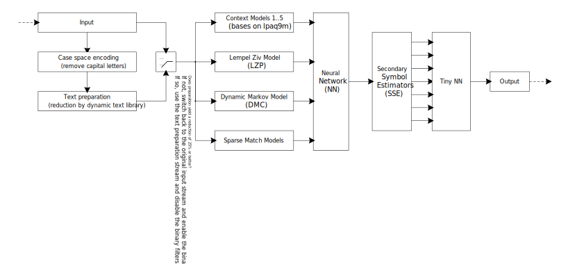

<a href="#">
  
</a>


# Moruga
High Performance Data Compression

### Why the name Moruga?

The name Moruga comes from the Spanish pepper [Moruga](https://en.wikipedia.org/wiki/Trinidad_Moruga_scorpion).

I chose this name because I had two goals in mind while making it.
* The algorithm should be as fast as possible.
* The memory usage of the algorithm should be minimal.

During the creation of the implementation, it was always assumed that the memory usage (option -6) should be less than 2 GiB with an acceptable speed (about 180 seconds or so for enwik8).

And another premise was that this data compressor is not written for a specific data format or file (such as enwik8 or 9).
The benchmarks of Moruga does not rely on external preprocessor applications or dictionaries.

It must be a data compressor suitable for any data type, be it text or binary.

Adding it all up and compare it to the top of [LTCB](http://mattmahoney.net/dc/text.html), then this implementation and performance is definitely a hot pepper...

### Acknowledgements

Moruga uses the [hashtable](https://probablydance.com/2017/02/26/i-wrote-the-fastest-hashtable/) made by [Malte Skarupke](https://github.com/skarupke/flat_hash_map).

Moruga has taken advantage of ideas in the [data compression community](https://encode.su/).

Here are some of the major contributors:

* Matt Mahoney
* Alex Rhatushnyak


### Simplified architecture of Moruga

<a href="#">
  
</a>

## How to build Moruga?
### Moruga was build and tested on [MSYS2](https://www.msys2.org/) and [Ubuntu LTS 20](https://ubuntu.com/)
Moruga does also build using [cygwin](https://www.cygwin.com/), but is not recommended due to the DLL hell of cygwin. Currently Moruga does not build with VS due to C++ compiler incompatibility (weak C++20 support) and lack of 128-bit variables.


For building a release version of Moruga (using [GCC](https://gcc.gnu.org/)).

```bash
make
```

To clean-up the build version

```bash
make clean
```

For building a guided release version of Moruga (using [GCC](https://gcc.gnu.org/)).
This guided release needes '[enwik8](https://cs.fit.edu/~mmahoney/compression/textdata.html)' as input file.

```bash
make guided
```

For building a debug version of Moruga (using [GCC](https://gcc.gnu.org/)).

```bash
make MODE=debug
```

To clean-up the build version

```bash
make MODE=debug clean
```

For building a release version of Moruga (using [LLVM](https://llvm.org/)).

```bash
make TOOLCHAIN=llvm
```

For building a debug version of Moruga (using [LLVM](https://llvm.org/)).

```bash
make MODE=debug TOOLCHAIN=llvm
```

Static code analysis of all CPP files of Moruga (using [LLVM](https://llvm.org/)).

```bash
make tidy
```


## Moruga enwik8 and enwik9 benchmarks

Moruga does not rely on external dictionaries or other preprocessor applications (such as DRT or enwik9-preproc).
Personally, I think this is a form of cheating or pretending your performance is better than it is.

```bash
Moruga c <option> <infile> <outfile>
```

| File | Original | Compressed | Ratio | Option | Memory used | Time used | Speed |
|:-----|:--------:|:----------:|:-----:|:------:|:-----------:|:---------:|:-----:|
| enwik8 | 100000000 | 18930707 | 18% | -0 | 73 MiB | 209.0 s | 2090 ns/byte |
| enwik8 | 100000000 | 18561932 | 18% | -1 | 101 MiB | 213.4 s | 2134 ns/byte |
| enwik8 | 100000000 | 18195456 | 18% | -2 | 157 MiB | 207.7 s | 2077 ns/byte |
| enwik8 | 100000000 | 17883433 | 17% | -3 | 269 MiB | 213.5 s | 2135 ns/byte |
| enwik8 | 100000000 | 17670140 | 17% | -4 | 494 MiB | 202.4 s | 2024 ns/byte |
| enwik8 | 100000000 | 17551952 | 17% | -5 | 943 MiB | 206.2 s | 2062 ns/byte |
| enwik8 | 100000000 | 17478711 | 17% | -6 | 1841 MiB | 213.6 s | 2136 ns/byte |
| enwik8 | 100000000 | 17469401 | 17% | -7 | 3636 MiB | 215.3 s | 2153 ns/byte |
| enwik8 | 100000000 | 17467145 | 17% | -8 | 7227 MiB | 217.4 s | 2174 ns/byte |
| enwik8 | 100000000 | 17466479 | 17% | -9 | 13383 MiB | 219.5 s | 2195 ns/byte |
| enwik9 | 1000000000 | 157861646 | 15% | -0 | 139 MiB | 1887.1 s | 1887 ns/byte |
| enwik9 | 1000000000 | 154645029 | 15% | -1 | 139 MiB | 1908.4 s | 1908 ns/byte |
| enwik9 | 1000000000 | 150936931 | 15% | -2 | 158 MiB | 1929.1 s | 1929 ns/byte |
| enwik9 | 1000000000 | 147104858 | 14% | -3 | 270 MiB | 1952.1 s | 1952 ns/byte |
| enwik9 | 1000000000 | 143534806 | 14% | -4 | 494 MiB | 1957.1 s | 1957 ns/byte |
| enwik9 | 1000000000 | 140560031 | 14% | -5 | 944 MiB | 2007.8 s | 2008 ns/byte |
| enwik9 | 1000000000 | 138194578 | 13% | -6 | 1841 MiB | 2063.1 s | 2063 ns/byte |
| enwik9 | 1000000000 | 136929125 | 13% | -7 | 3637 MiB | 2133.9 s | 2134 ns/byte |
| enwik9 | 1000000000 | 136393339 | 13% | -8 | 7228 MiB | 2136.0 s | 2136 ns/byte |
| enwik9 | 1000000000 | 136067454 | 13% | -9 | 13384 MiB | 2154.4 s | 2154 ns/byte |


### Benchmarks compared to BZIP2

```bash
bzip2 --best <infile>
```

| File | Original | Compressed | Ratio |
|:-----|:--------:|:----------:|:-----:|
| enwik8 | 100000000 | 29008758 | 29%
| enwik9 | 1000000000 | 253977891 | 25%


### Benchmarks compared to GZIP

```bash
gzip --best <infile>
```

| File | Original | Compressed | Ratio |
|:-----|:--------:|:----------:|:-----:|
| enwik8 | 100000000 | 36445248 | 36%
| enwik9 | 1000000000 | 322591995 | 32%


### Benchmarks compared to XZ

```bash
xz --lzma2=preset=9e,dict=1GiB,lc=4,pb=0 <infile>
```

| File | Original | Compressed | Ratio |
|:-----|:--------:|:----------:|:-----:|
| enwik8 | 100000000 | 24703772 | 24%
| enwik9 | 1000000000 | 197331816 | 19%


## Moruga [silesia](http://mattmahoney.net/dc/silesia.html) benchmarks

```bash
Moruga c <option> <infile> <outfile>
```

| File | Original | Compressed | Ratio | Option | Memory used | Time used | Speed |
|:-----|:--------:|:----------:|:-----:|:------:|:-----------:|:---------:|:-----:|
| silesia/dickens | 10192446 | 2061249 | 20% | -6 | 1841 MiB | 20.0 s | 1962 ns/byte |
| silesia/mozilla | 51220480 | 10274238 | 20% | -6 | 1857 MiB | 179.8 s | 3510 ns/byte |
| silesia/mr | 9970564 | 2107121 | 21% | -6 | 1840 MiB | 22.4 s | 2250 ns/byte |
| silesia/nci | 33553445 | 968696 | 2% | -6 | 1841 MiB | 20.4 s | 607 ns/byte |
| silesia/ooffice | 6152192 | 1738791 | 28% | -6 | 1840 MiB | 21.6 s | 3504 ns/byte |
| silesia/osdb | 10085684 | 2153618 | 21% | -6 | 1840 MiB | 36.2 s | 3585 ns/byte |
| silesia/reymont | 6627202 | 862627 | 13% | -6 | 1857 MiB | 19.4 s | 2926 ns/byte |
| silesia/samba | 21606400 | 2243059 | 10% | -6 | 1856 MiB | 72.2 s | 3343 ns/byte |
| silesia/sao | 7251944 | 4363153 | 60% | -6 | 1840 MiB | 31.2 s | 4301 ns/byte |
| silesia/webster | 41458703 | 5453921 | 13% | -6 | 1841 MiB | 84.3 s | 2034 ns/byte |
| silesia/x-ray | 8474240 | 3630225 | 42% | -6 | 1840 MiB | 28.6 s | 3371 ns/byte |
| silesia/xml | 5345280 | 307181 | 5% | -6 | 1840 MiB | 8.6 s | 1617 ns/byte |


### Benchmarks compared to BZIP2

```bash
bzip2 --best <infile>
```

| File | Original | Compressed | Ratio |
|:-----|:--------:|:----------:|:-----:|
| silesia/dickens | 10192446 | 2799520 | 27%
| silesia/mozilla | 51220480 | 17914392 | 34%
| silesia/mr | 9970564 | 2441280 | 24%
| silesia/nci | 33553445 | 1812734 | 5%
| silesia/ooffice | 6152192 | 2862526 | 46%
| silesia/osdb | 10085684 | 2802792 | 27%
| silesia/reymont | 6627202 | 1246230 | 18%
| silesia/samba | 21606400 | 4549759 | 21%
| silesia/sao | 7251944 | 4940524 | 68%
| silesia/webster | 41458703 | 8644714 | 20%
| silesia/x-ray | 8474240 | 4051112 | 47%
| silesia/xml | 5345280 | 441186 | 8%


### Benchmarks compared to GZIP

```bash
gzip --best <infile>
```

| File | Original | Compressed | Ratio |
|:-----|:--------:|:----------:|:-----:|
| silesia/dickens | 10192446 | 3851823 | 37%
| silesia/mozilla | 51220480 | 18994142 | 37%
| silesia/mr | 9970564 | 3673940 | 36%
| silesia/nci | 33553445 | 2987533 | 8%
| silesia/ooffice | 6152192 | 3090442 | 50%
| silesia/osdb | 10085684 | 3716342 | 36%
| silesia/reymont | 6627202 | 1820834 | 27%
| silesia/samba | 21606400 | 5408272 | 25%
| silesia/sao | 7251944 | 5327041 | 73%
| silesia/webster | 41458703 | 12061624 | 29%
| silesia/x-ray | 8474240 | 6037713 | 71%
| silesia/xml | 5345280 | 662284 | 12%


### Benchmarks compared to XZ

```bash
xz --lzma2=preset=9e,dict=1GiB,lc=4,pb=0 <infile>
```

| File | Original | Compressed | Ratio |
|:-----|:--------:|:----------:|:-----:|
| silesia/dickens | 10192446 | 2825584 | 27%
| silesia/mozilla | 51220480 | 13672236 | 26%
| silesia/mr | 9970564 | 2758392 | 27%
| silesia/nci | 33553445 | 1440120 | 4%
| silesia/ooffice | 6152192 | 2421724 | 39%
| silesia/osdb | 10085684 | 2861260 | 28%
| silesia/reymont | 6627202 | 1313860 | 19%
| silesia/samba | 21606400 | 3728036 | 17%
| silesia/sao | 7251944 | 4638136 | 63%
| silesia/webster | 41458703 | 8358852 | 20%
| silesia/x-ray | 8474240 | 4508396 | 53%
| silesia/xml | 5345280 | 433876 | 8%


## Moruga [calgary](https://corpus.canterbury.ac.nz/descriptions/) benchmarks


```bash
Moruga c <option> <infile> <outfile>
```

| File | Original | Compressed | Ratio | Option | Memory used | Time used | Speed |
|:-----|:--------:|:----------:|:-----:|:------:|:-----------:|:---------:|:-----:|
| calgary/bib | 111261 | 22661 | 20% | -6 | 1840 MiB | 0.8 s | 7361 ns/byte |
| calgary/book1 | 768771 | 199205 | 25% | -6 | 1840 MiB | 2.3 s | 3031 ns/byte |
| calgary/book2 | 610856 | 128622 | 21% | -6 | 1840 MiB | 1.8 s | 2909 ns/byte |
| calgary/geo | 102400 | 45746 | 44% | -6 | 1840 MiB | 0.9 s | 8812 ns/byte |
| calgary/news | 377109 | 95467 | 25% | -6 | 1840 MiB | 1.5 s | 3989 ns/byte |
| calgary/obj1 | 21504 | 8817 | 41% | -6 | 1840 MiB | 0.6 s | 26276 ns/byte |
| calgary/obj2 | 246814 | 55894 | 22% | -6 | 1840 MiB | 1.3 s | 5362 ns/byte |
| calgary/paper1 | 53161 | 14160 | 26% | -6 | 1840 MiB | 0.6 s | 11697 ns/byte |
| calgary/paper2 | 82199 | 21685 | 26% | -6 | 1840 MiB | 0.7 s | 8303 ns/byte |
| calgary/paper3 | 46526 | 13857 | 29% | -6 | 1840 MiB | 0.6 s | 13312 ns/byte |
| calgary/paper4 | 13286 | 4444 | 33% | -6 | 1840 MiB | 0.5 s | 36810 ns/byte |
| calgary/paper5 | 11954 | 4225 | 35% | -6 | 1840 MiB | 0.5 s | 40963 ns/byte |
| calgary/paper6 | 38105 | 10403 | 27% | -6 | 1840 MiB | 0.6 s | 14673 ns/byte |
| calgary/pic | 513216 | 44212 | 8% | -6 | 1840 MiB | 1.2 s | 2294 ns/byte |
| calgary/progc | 39611 | 10531 | 26% | -6 | 1840 MiB | 0.6 s | 15597 ns/byte |
| calgary/progl | 71646 | 11906 | 16% | -6 | 1840 MiB | 0.6 s | 8584 ns/byte |
| calgary/progp | 49379 | 8410 | 17% | -6 | 1840 MiB | 0.6 s | 12578 ns/byte |
| calgary/trans | 93695 | 13191 | 14% | -6 | 1840 MiB | 0.8 s | 8078 ns/byte |


## Benchmarks compared to BZIP2

```bash
bzip2 --best <infile>
```

| File | Original | Compressed | Ratio |
|:-----|:--------:|:----------:|:-----:|
| calgary/bib | 111261 | 27467 | 24%
| calgary/book1 | 768771 | 232598 | 30%
| calgary/book2 | 610856 | 157443 | 25%
| calgary/geo | 102400 | 56921 | 55%
| calgary/news | 377109 | 118600 | 31%
| calgary/obj1 | 21504 | 10787 | 50%
| calgary/obj2 | 246814 | 76441 | 30%
| calgary/paper1 | 53161 | 16558 | 31%
| calgary/paper2 | 82199 | 25041 | 30%
| calgary/paper3 | 46526 | 15837 | 34%
| calgary/paper4 | 13286 | 5188 | 39%
| calgary/paper5 | 11954 | 4837 | 40%
| calgary/paper6 | 38105 | 12292 | 32%
| calgary/pic | 513216 | 49759 | 9%
| calgary/progc | 39611 | 12544 | 31%
| calgary/progl | 71646 | 15579 | 21%
| calgary/progp | 49379 | 10710 | 21%
| calgary/trans | 93695 | 17899 | 19%


## Benchmarks compared to GZIP

```bash
gzip --best <infile>
```

| File | Original | Compressed | Ratio |
|:-----|:--------:|:----------:|:-----:|
| calgary/bib | 111261 | 34900 | 31%
| calgary/book1 | 768771 | 312281 | 40%
| calgary/book2 | 610856 | 206158 | 33%
| calgary/geo | 102400 | 68414 | 66%
| calgary/news | 377109 | 144400 | 38%
| calgary/obj1 | 21504 | 10320 | 47%
| calgary/obj2 | 246814 | 81087 | 32%
| calgary/paper1 | 53161 | 18543 | 34%
| calgary/paper2 | 82199 | 29667 | 36%
| calgary/paper3 | 46526 | 18074 | 38%
| calgary/paper4 | 13286 | 5534 | 41%
| calgary/paper5 | 11954 | 4995 | 41%
| calgary/paper6 | 38105 | 13213 | 34%
| calgary/pic | 513216 | 52381 | 10%
| calgary/progc | 39611 | 13261 | 33%
| calgary/progl | 71646 | 16164 | 22%
| calgary/progp | 49379 | 11186 | 22%
| calgary/trans | 93695 | 18862 | 20%


## Benchmarks compared to XZ

```bash
xz --lzma2=preset=9e,dict=1GiB,lc=4,pb=0 <infile>
```

| File | Original | Compressed | Ratio |
|:-----|:--------:|:----------:|:-----:|
| calgary/bib | 111261 | 30540 | 27%
| calgary/book1 | 768771 | 260944 | 33%
| calgary/book2 | 610856 | 169580 | 27%
| calgary/geo | 102400 | 54268 | 52%
| calgary/news | 377109 | 118384 | 31%
| calgary/obj1 | 21504 | 9408 | 43%
| calgary/obj2 | 246814 | 63012 | 25%
| calgary/paper1 | 53161 | 17300 | 32%
| calgary/paper2 | 82199 | 27252 | 33%
| calgary/paper3 | 46526 | 17100 | 36%
| calgary/paper4 | 13286 | 5424 | 40%
| calgary/paper5 | 11954 | 4928 | 41%
| calgary/paper6 | 38105 | 12512 | 32%
| calgary/pic | 513216 | 39980 | 7%
| calgary/progc | 39611 | 12596 | 31%
| calgary/progl | 71646 | 14968 | 20%
| calgary/progp | 49379 | 10388 | 21%
| calgary/trans | 93695 | 16592 | 17%


## Moruga [canterbury](https://corpus.canterbury.ac.nz/descriptions/) benchmarks

```bash
Moruga c <option> <infile> <outfile>
```

| File | Original | Compressed | Ratio | Option | Memory used | Time used | Speed |
|:-----|:--------:|:----------:|:-----:|:------:|:-----------:|:---------:|:-----:|
| canterbury/alice29.txt | 152089 | 36800 | 24% | -6 | 1840 MiB | 0.8 s | 5465 ns/byte |
| canterbury/alphabet.txt | 100000 | 160 | 0% | -6 | 1840 MiB | 0.5 s | 4877 ns/byte |
| canterbury/asyoulik.txt | 125179 | 34107 | 27% | -6 | 1840 MiB | 0.8 s | 6703 ns/byte |
| canterbury/bible.txt | 4047392 | 635889 | 15% | -6 | 1840 MiB | 7.3 s | 1799 ns/byte |
| canterbury/cp.html | 24603 | 6404 | 26% | -6 | 1840 MiB | 0.8 s | 30664 ns/byte |
| canterbury/e.coli | 4638690 | 1108682 | 23% | -6 | 1841 MiB | 10.8 s | 2332 ns/byte |
| canterbury/fields.c | 11150 | 2566 | 23% | -6 | 1840 MiB | 0.5 s | 45071 ns/byte |
| canterbury/grammar.lsp | 3721 | 1054 | 28% | -6 | 1840 MiB | 0.5 s | 134521 ns/byte |
| canterbury/kennedy.xls | 1029744 | 16798 | 1% | -6 | 1840 MiB | 2.5 s | 2409 ns/byte |
| canterbury/lcet10.txt | 426754 | 88848 | 20% | -6 | 1840 MiB | 1.3 s | 3112 ns/byte |
| canterbury/pi.txt | 1000000 | 415680 | 41% | -6 | 1840 MiB | 2.5 s | 2543 ns/byte |
| canterbury/plrabn12.txt | 481861 | 125862 | 26% | -6 | 1840 MiB | 1.6 s | 3295 ns/byte |
| canterbury/ptt5 | 513216 | 44212 | 8% | -6 | 1840 MiB | 1.1 s | 2166 ns/byte |
| canterbury/random.txt | 100000 | 75345 | 75% | -6 | 1840 MiB | 0.9 s | 9101 ns/byte |
| canterbury/sum | 38240 | 9560 | 25% | -6 | 1840 MiB | 0.6 s | 16663 ns/byte |
| canterbury/xargs.1 | 4227 | 1539 | 36% | -6 | 1840 MiB | 0.5 s | 114614 ns/byte |


## Benchmarks compared to BZIP2

```bash
bzip2 --best <infile>
```

| File | Original | Compressed | Ratio |
|:-----|:--------:|:----------:|:-----:|
| canterbury/alice29.txt | 152089 | 43202 | 28%
| canterbury/alphabet.txt | 100000 | 131 | 0%
| canterbury/asyoulik.txt | 125179 | 39569 | 31%
| canterbury/bible.txt | 4047392 | 845635 | 20%
| canterbury/cp.html | 24603 | 7624 | 30%
| canterbury/e.coli | 4638690 | 1251004 | 26%
| canterbury/fields.c | 11150 | 3039 | 27%
| canterbury/grammar.lsp | 3721 | 1283 | 34%
| canterbury/kennedy.xls | 1029744 | 130280 | 12%
| canterbury/lcet10.txt | 426754 | 107706 | 25%
| canterbury/pi.txt | 1000000 | 431671 | 43%
| canterbury/plrabn12.txt | 481861 | 145577 | 30%
| canterbury/ptt5 | 513216 | 49759 | 9%
| canterbury/random.txt | 100000 | 75684 | 75%
| canterbury/sum | 38240 | 12909 | 33%
| canterbury/xargs.1 | 4227 | 1762 | 41%


## Benchmarks compared to GZIP

```bash
gzip --best <infile>
```

| File | Original | Compressed | Ratio |
|:-----|:--------:|:----------:|:-----:|
| canterbury/alice29.txt | 152089 | 54191 | 35%
| canterbury/alphabet.txt | 100000 | 315 | 0%
| canterbury/asyoulik.txt | 125179 | 48829 | 39%
| canterbury/bible.txt | 4047392 | 1176645 | 29%
| canterbury/cp.html | 24603 | 7981 | 32%
| canterbury/e.coli | 4638690 | 1299066 | 28%
| canterbury/fields.c | 11150 | 3136 | 28%
| canterbury/grammar.lsp | 3721 | 1246 | 33%
| canterbury/kennedy.xls | 1029744 | 209733 | 20%
| canterbury/lcet10.txt | 426754 | 144429 | 33%
| canterbury/pi.txt | 1000000 | 470440 | 47%
| canterbury/plrabn12.txt | 481861 | 194277 | 40%
| canterbury/ptt5 | 513216 | 52382 | 10%
| canterbury/random.txt | 100000 | 75689 | 75%
| canterbury/sum | 38240 | 12772 | 33%
| canterbury/xargs.1 | 4227 | 1756 | 41%


## Benchmarks compared to XZ

```bash
xz --lzma2=preset=9e,dict=1GiB,lc=4,pb=0 <infile>
```

| File | Original | Compressed | Ratio |
|:-----|:--------:|:----------:|:-----:|
| canterbury/alice29.txt | 152089 | 48600 | 31%
| canterbury/alphabet.txt | 100000 | 156 | 0%
| canterbury/asyoulik.txt | 125179 | 44628 | 35%
| canterbury/bible.txt | 4047392 | 885096 | 21%
| canterbury/cp.html | 24603 | 7700 | 31%
| canterbury/e.coli | 4638690 | 1187228 | 25%
| canterbury/fields.c | 11150 | 3052 | 27%
| canterbury/grammar.lsp | 3721 | 1312 | 35%
| canterbury/kennedy.xls | 1029744 | 48016 | 4%
| canterbury/lcet10.txt | 426754 | 118948 | 27%
| canterbury/pi.txt | 1000000 | 441824 | 44%
| canterbury/plrabn12.txt | 481861 | 165336 | 34%
| canterbury/ptt5 | 513216 | 39980 | 7%
| canterbury/random.txt | 100000 | 76940 | 76%
| canterbury/sum | 38240 | 9668 | 25%
| canterbury/xargs.1 | 4227 | 1832 | 43%
